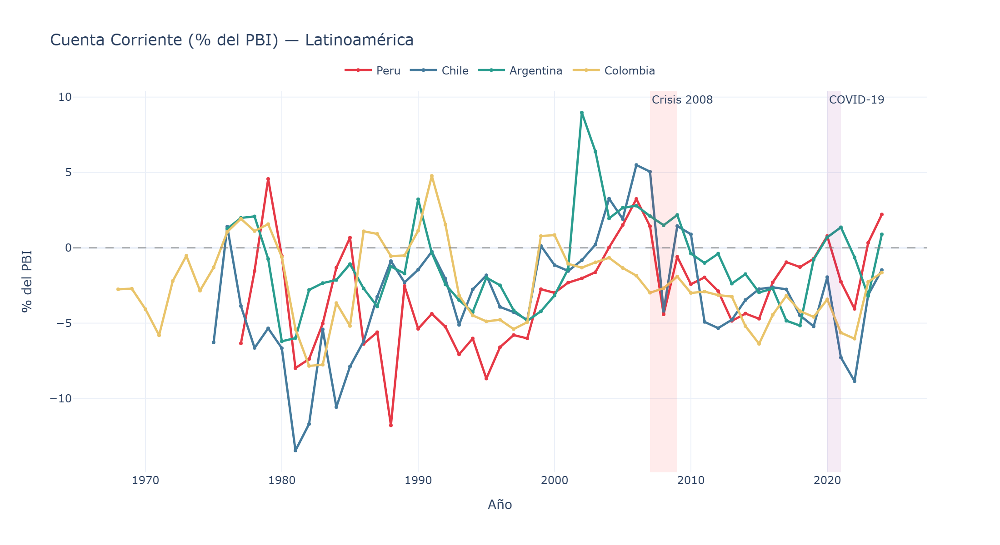
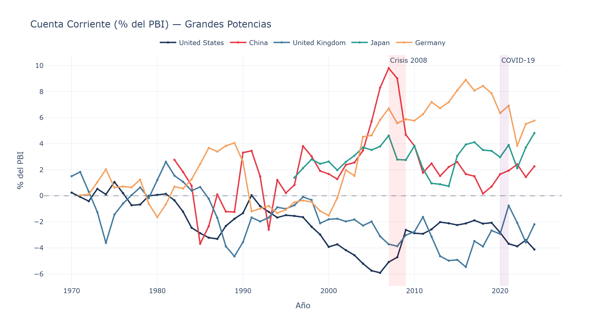
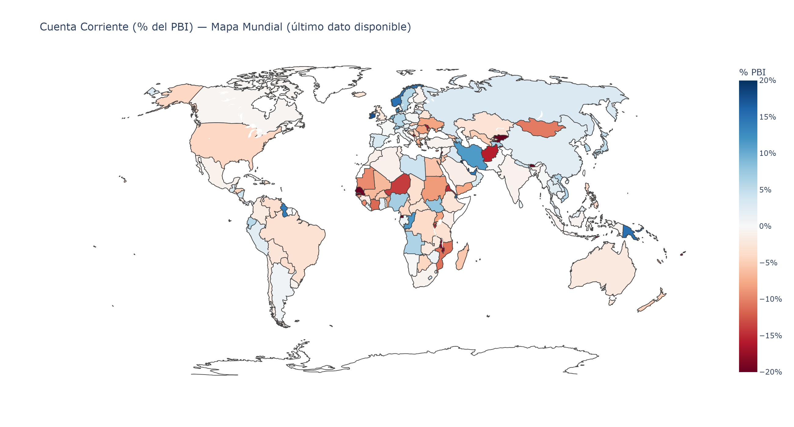
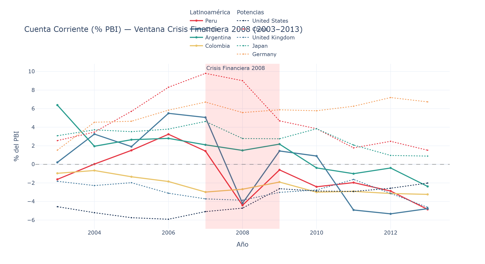
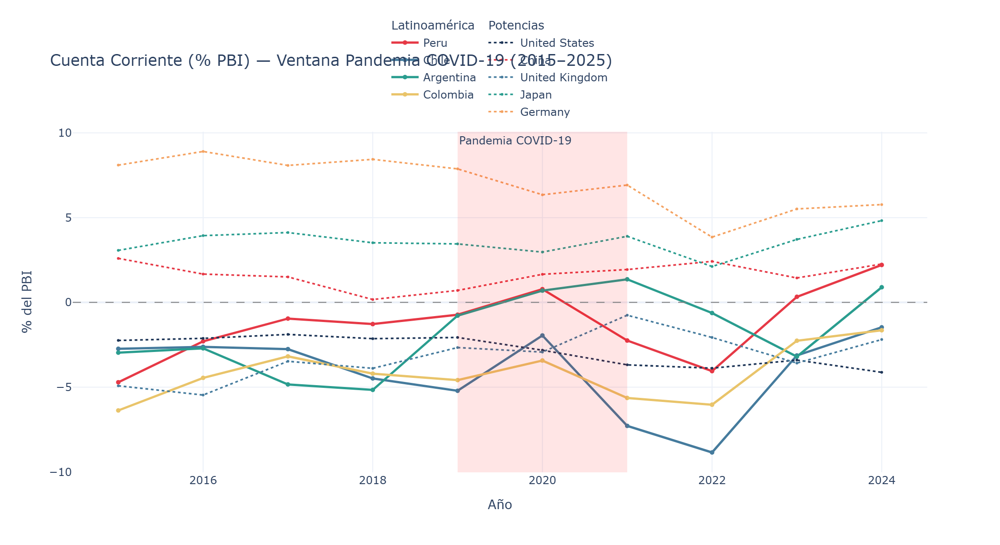

# S1 — Cuenta Corriente como porcentaje del PBI

## Fuente de datos

- **Indicador:** Current account balance (% of GDP) — `BN.CAB.XOKA.GD.ZS`
- **Fuente:** World Development Indicators (Banco Mundial)
- **Ultima actualizacion:** 2026-02-24

---

## 1. Cuenta Corriente — Latinoamerica

**Paises:** Peru, Chile, Argentina, Colombia



**Observaciones clave:**
- Los cuatro paises muestran deficit cronico de cuenta corriente durante la mayor parte del periodo analizado.
- Chile destaca por sus oscilaciones mas pronunciadas, vinculadas al precio del cobre.
- Argentina presenta episodios de ajuste brusco asociados a crisis cambiarias (2001-2002, 2018-2019).
- Peru mantiene deficit moderados y relativamente estables post-2000.
- Colombia muestra un patron similar a Peru pero con mayor sensibilidad a precios del petroleo.

> Version interactiva: [`01_cuenta_corriente_latam.html`](graficos/01_cuenta_corriente_latam.html)

---

## 2. Cuenta Corriente — Grandes Potencias

**Paises:** Estados Unidos, China, Reino Unido, Japon, Alemania



**Observaciones clave:**
- Se configura un patron clasico de **desequilibrios globales**: EE.UU. y Reino Unido con deficit persistentes vs. China, Japon y Alemania con superavit.
- El superavit chino alcanzo su maximo (~10% del PBI) alrededor de 2007 y se ha moderado significativamente desde entonces.
- Alemania reemplazo a China como el principal pais superavitario en terminos relativos post-2010.
- Japon mantiene superavit estructural, impulsado por ingresos de inversion en el exterior.
- Se incluyo **Alemania** como quinta potencia por ser el principal superavitario de cuenta corriente del mundo desarrollado, contrapeso natural al deficit anglosaj on.

> Version interactiva: [`02_cuenta_corriente_potencias.html`](graficos/02_cuenta_corriente_potencias.html)

---

## 3. Mapa Mundial — Nivel actual de Cuenta Corriente



**Lectura del mapa:**
- **Azul:** superavit de cuenta corriente (exportadores netos de capital)
- **Rojo:** deficit de cuenta corriente (importadores netos de capital)
- Se observa que los grandes exportadores de materias primas (Medio Oriente, Noruega) y las economias manufactureras orientadas a la exportacion (Alemania, Corea, Paises Bajos) tienden al superavit.
- Los deficit mas pronunciados se concentran en economias emergentes con alta dependencia de importaciones.

> Version interactiva: [`03_mapa_cuenta_corriente.html`](graficos/03_mapa_cuenta_corriente.html)

---

## 4. Analisis por ventanas historicas

### 4.1 Ventana Crisis Financiera 2008 (2003–2013)



**Hallazgos:**
- La crisis de 2008 provoco un colapso del comercio mundial que ajusto bruscamente los desequilibrios: el deficit de EE.UU. se redujo y el superavit de China cayo.
- Para Latinoamerica, el efecto fue asimetrico: Chile y Peru vieron mejoras temporales (caida de importaciones), mientras que Argentina y Colombia experimentaron deterioros por la caida de precios de commodities.
- Post-crisis, los desequilibrios no regresaron a los niveles previos, marcando un cambio estructural.

### 4.2 Ventana Pandemia COVID-19 (2015–2025)



**Hallazgos:**
- La pandemia genero un shock temporal: la contraccion de importaciones mejoro la cuenta corriente en muchos paises en 2020.
- China experimento un repunte significativo de su superavit por el boom de exportaciones de bienes durante la pandemia.
- EE.UU. profundizo su deficit por los masivos estimulos fiscales que impulsaron el consumo importado.
- En Latinoamerica, la recuperacion post-pandemia ha sido heterogenea.

> Versiones interactivas: [`04_ventana_crisis_2008.html`](graficos/04_ventana_crisis_2008.html) | [`05_ventana_pandemia.html`](graficos/05_ventana_pandemia.html)

---

## 5. Graficos Dinamicos (Animaciones)

### 5.1 Evolucion temporal animada (barras)

Grafico de barras animado que permite reproducir la evolucion de la cuenta corriente de los 9 paises seleccionados desde 1990 hasta el presente, ano por ano.

> Abrir: [`06_animacion_temporal.html`](graficos/06_animacion_temporal.html)

### 5.2 Mapa mundial animado

Mapa coropletico animado que muestra la evolucion de la cuenta corriente de todos los paises del mundo desde 1990. Incluye controles de reproduccion y slider para navegar por ano.

> Abrir: [`07_mapa_animado.html`](graficos/07_mapa_animado.html)

---

## Estructura de archivos

```
S1/
├── S1.md                              ← Este documento
├── generar_graficos.py                ← Script de generacion
└── graficos/
    ├── 01_cuenta_corriente_latam.png
    ├── 01_cuenta_corriente_latam.html
    ├── 02_cuenta_corriente_potencias.png
    ├── 02_cuenta_corriente_potencias.html
    ├── 03_mapa_cuenta_corriente.png
    ├── 03_mapa_cuenta_corriente.html
    ├── 04_ventana_crisis_2008.png
    ├── 04_ventana_crisis_2008.html
    ├── 05_ventana_pandemia.png
    ├── 05_ventana_pandemia.html
    ├── 06_animacion_temporal.html      ← Solo interactivo
    └── 07_mapa_animado.html            ← Solo interactivo
```
